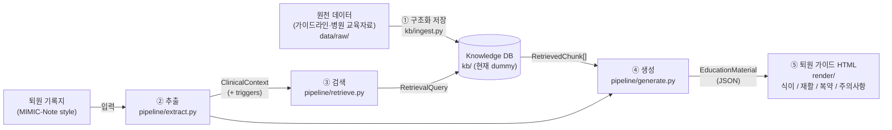

# 아키텍처

2026-09-30 팀 회의에서 정한 설계 (알고리즘 도식):

| 단계 (회의 로드맵) | 모듈 | 상태 |
|---|---|---|
| 1) 날것의 데이터를 구조화 | `kb/ingest.py` → `data/processed/` | stub (계약만 정의) |
| 2) 구조화한 것을 잘 끌어오기 | `kb/store.py` (Protocol), `kb/dummy.py`, `pipeline/retrieve.py` | dummy 인메모리 store |
| 3) 잘 생성하기 | `pipeline/extract.py`, `pipeline/generate.py`, `llm/client.py` | 동작함, 프롬프트는 초안 |
| 5) html 형태로 보기좋게 제시 | `render/html.py`, `render/templates/education.html.j2` | 최소 구현 |
| 평가 (누락 없이 / 기존 정보로 / 가독성) | — | 미착수 (1차 평가 10월말) |

## 요청 흐름 (`POST /v1/education`)

1. **추출** (LLM 호출 1): 노트 텍스트 → `ClinicalContext` (심부전 유형, EF, 퇴원 약물, 식이/활동
   지시, 추적 관찰, 그리고 고칼륨혈증 같은 개인화 `triggers`). 각 항목은 원문 그대로의 `evidence`
   구간을 함께 보존한다.
2. **검색** (LLM 없음): orchestrator가 각 핵심 주제(topic)마다 해당 주제와 관련된 활성 trigger
   (`TRIGGER_TOPICS`)를 포함한 `RetrievalQuery`를 만들어 `KnowledgeStore`를 호출한다.
3. **생성** (LLM 호출 2, + 최대 1회 재시도): context + 검색된 chunk → `EducationDraft`.
   인용(citation)은 실제로 제공된 ID와 대조하여 검증한다 (`docs/db_contract.md` 참고).
4. **마무리** (LLM 없음): 제목, `triggers_applied`, `clinician_consult`는 코드가 설정한다.
5. **렌더링**: Jinja2 → 번호 매긴 출처 각주와 "초안, 의료진 미검토" 배너가 포함된 HTML.

## 주제 (Topics)

`diet` (식이), `activity` (재활), `medication` (복약), `symptom_action` (주의사항: 증상악화 대처법,
매일 체중 측정 포함). `followup`은 enum에는 있지만 핵심 주제는 아니다 (09-30: 외래예약 데이터는
실제로 활용하기 어려움).

## 개인화 trigger

09-30 회의 내용: 개인화에 필요한 자료가 비식별화되어 있어, 식이에 대한 위험 트리거(예: 고칼륨혈증)를
추출해 트리거 on/off에 따라 교육자료가 달라지도록 하고, 트리거가 있으면 의료진 상담 필요를 알린다.

- `TriggerCode` (schemas/common.py)는 추출과 KB 태깅이 공유하는 어휘다.
- KB chunk는 `applies_when: [TriggerCode]`를 선언하며, 해당 trigger가 켜져 있을 때만 검색된다.
- 활성 trigger가 있는 주제의 섹션은 `clinician_consult=true`가 되며 안내 문구로 렌더링된다.
- trigger 추가 = enum 값 추가 + `TRIGGER_TOPICS` 항목 추가 + KB chunk 태깅 + (임상팀) 검토.
