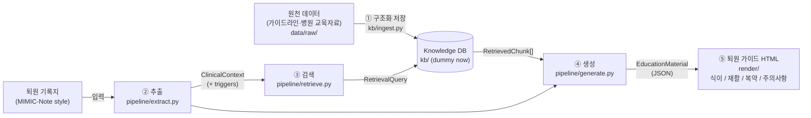

# Architecture

Design from the 2026-09-30 team meeting (algorithm schema):

| Stage (meeting roadmap) | Module | Status |
|---|---|---|
| 1) 날것의 데이터를 구조화 | `kb/ingest.py` → `data/processed/` | stub (contract only) |
| 2) 구조화한 것을 잘 끌어오기 | `kb/store.py` (Protocol), `kb/dummy.py`, `pipeline/retrieve.py` | dummy in-memory store |
| 3) 잘 생성하기 | `pipeline/extract.py`, `pipeline/generate.py`, `llm/client.py` | working, prompts are first drafts |
| 5) html 형태로 보기좋게 제시 | `render/html.py`, `render/templates/education.html.j2` | minimal |
| Evaluation (누락 없이 / 기존 정보로 / 가독성) | — | not started (1차 평가 10월말) |

## Request flow (`POST /v1/education`)

1. **Extract** (LLM call 1): note text → `ClinicalContext` (HF type, EF, discharge meds, diet/activity
   instructions, follow-up, and personalization `triggers` such as hyperkalemia). Each item keeps a
   verbatim `evidence` span.
2. **Retrieve** (no LLM): for each core topic the orchestrator builds a `RetrievalQuery` with the
   active triggers relevant to that topic (`TRIGGER_TOPICS`), and calls the `KnowledgeStore`.
3. **Generate** (LLM call 2, + at most 1 retry): context + retrieved chunks → `EducationDraft`.
   Citations are validated against the IDs actually provided (see `docs/db_contract.md`).
4. **Finalize** (no LLM): titles, `triggers_applied` and `clinician_consult` are set by code.
5. **Render**: Jinja2 → HTML with numbered source footnotes and a "draft, not clinician-reviewed" banner.

## Topics

`diet` (식이), `activity` (재활), `medication` (복약), `symptom_action` (주의사항: 증상악화 대처법, incl.
daily weight monitoring). `followup` exists in the enum but is not a core topic (09-30: 외래예약 data
is hard to use in practice).

## Personalization triggers

From 09-30: 개인화에 필요한 자료가 비식별화되어 있어, 식이에 대한 위험 트리거(예: 고칼륨혈증)를 추출해
트리거 on/off에 따라 교육자료가 달라지도록 하고, 트리거가 있으면 의료진 상담 필요를 알린다.

- `TriggerCode` (schemas/common.py) is the shared vocabulary between extraction and KB tagging.
- KB chunks declare `applies_when: [TriggerCode]`; they are only retrieved when that trigger is on.
- A section whose topic has an active trigger gets `clinician_consult=true` (rendered as a notice).
- Adding a trigger = add enum value + `TRIGGER_TOPICS` entry + tag KB chunks + (clinician team) review.
